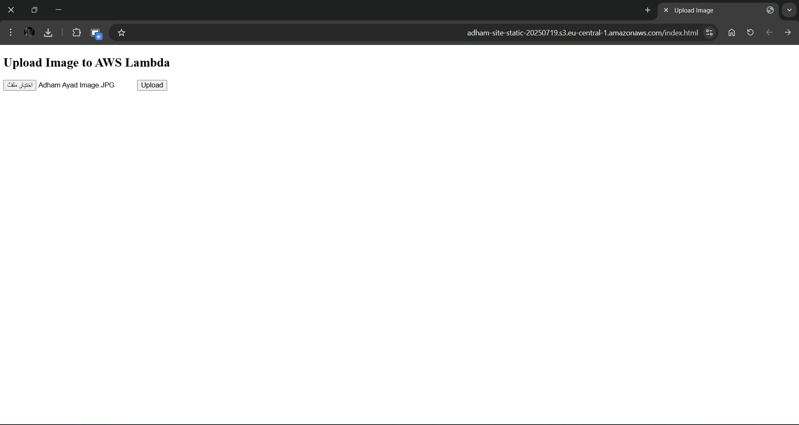
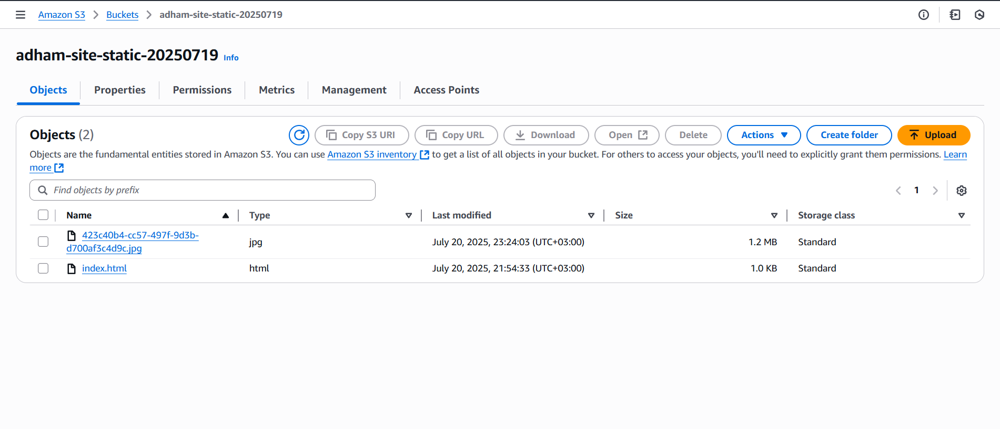
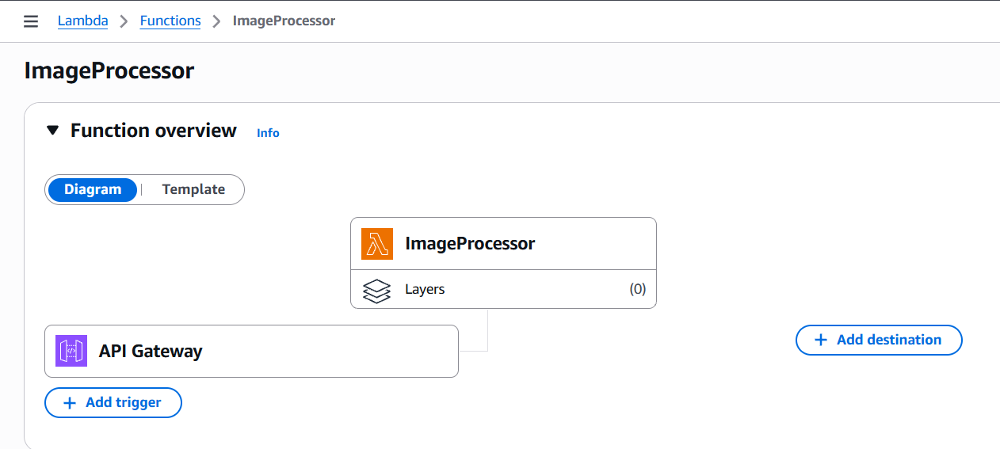
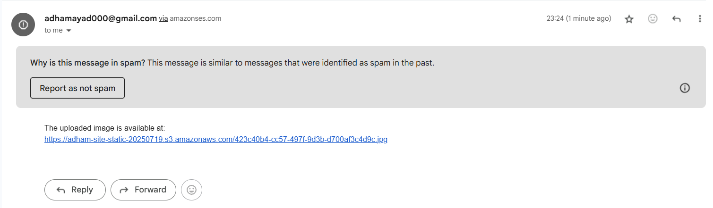

# 📸 Upload Image & Email Link via AWS Lambda

This project demonstrates a simple **Serverless architecture** using:

- 🧑‍💻 Static Website hosted on **Amazon S3**
- ⚙️ Backend logic using **AWS Lambda**
- 📤 Sending Emails with **Amazon SES**
- ☁️ Uploading files to **Amazon S3**

---

## 🧠 Project Flow

1. User uploads an image via the static website  
2. Image is sent to API Gateway → invokes Lambda function  
3. Lambda function:  
   - uploads image to an S3 bucket  
   - generates the image URL  
   - sends the URL via email using Amazon SES  
4. Image is accessible via public link

---

## 🖼️ Project Diagram


---

## 🌐 Static Website



---

## 📤 Image Upload Flow

### Before Upload


### After Upload


---

## ⚙️ Lambda Function



---

## 📧 Email Sent



---

## 🔗 Image Link in Email


---

## 📁 Project Structure

```bash
📁 web                # Frontend static website (HTML/JS)
📁 Lambda_Code        # Lambda function code (Python)
📁 assets             # Documentation screenshots and diagrams
